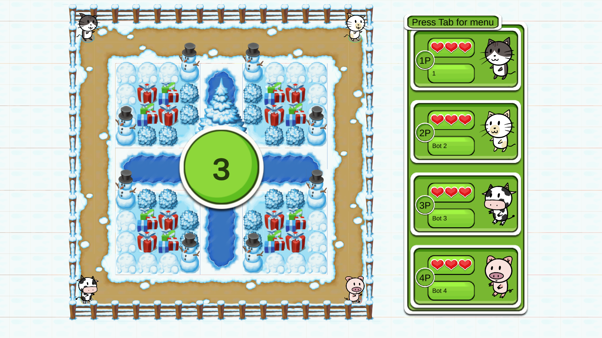
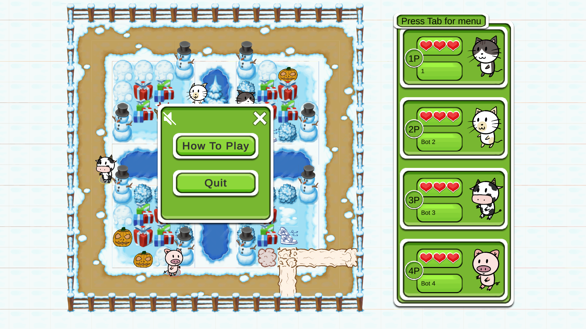

# Boom

Bomberman-like Unity casual game.

### Menu

  

Details

  
+ First, select local mode or online mode, or checkout the playing instruction:
  

  

+ The playing instruction:

  

+ Second, select solo mode or duo mode, which decides how many players can play on this computer at the same time:

  

+ Third, enter your name(s) and go to the room (for local mode) or lobby (for online mode):

  

  

### Lobby

  

Details

  
+ Click on the refresh button to refresh the room list. 
+ Click on a room to join. 
+ The gamepad icon means the room is in game. 
+ The lock icon means the room requires password. 

  

+ Click on the plus icon to create a new room. 
+ Toggle the password radio button to change whether the room requires password.

  

  

+ If the room you want to join requires password, enter the password the join the room:

  

### Room

  

Details

+ Users can select characters and bombs for their pwn players (duo mode user has two players) and bots. 
+ Users can add and remove bots. Users can change the map. 
+ After selecting characters and bombs, users can click ready button to get ready.

  

+ When all players are ready, users can click start button to start the game. 
+ Users can click cancel button to cancel the ready status.

  

+ In local mode, the user need not to get ready to start the game.

  

### Game

  

Details

+ The game starts after a countdown.

  

+ Press put bomb button to put a bomb on your player's position. Initially each player can have only 1 bomb on the map, which can be increased by the bomb capacity item.
+ The bomb will explode in some time, generating a cross-shaped explosion area, which can destroy "chests" and items and damage players. The length of the explosion area can be increased by the bomb power item.
+ A destroyed "chest" has a chance to drop a random item.
+ Each player has 3 lives. Collect the live item to regain a lost live.
+ Collect the speed item to move faster.
+ When a player dies, it will drop all its items to random positions on the map.

  

+ Starting at a certain time, an aircraft will appear relularly to drop random items to random positions on the map.

  

+ Press Tab key to show the in the menu. In local mode, it will also pause the game.

  

+ The last surviving player will win the game.

  

+ Each map has its own background music and perhaps different item images.

  

